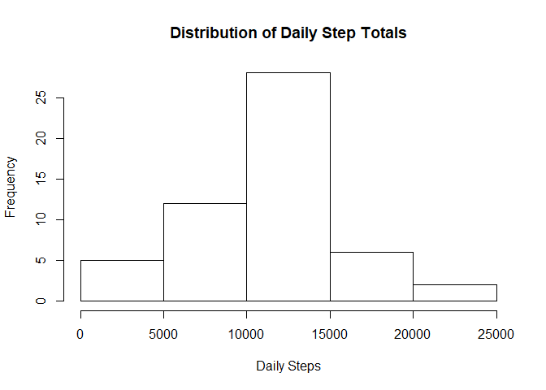
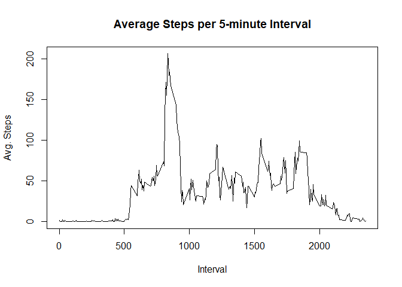
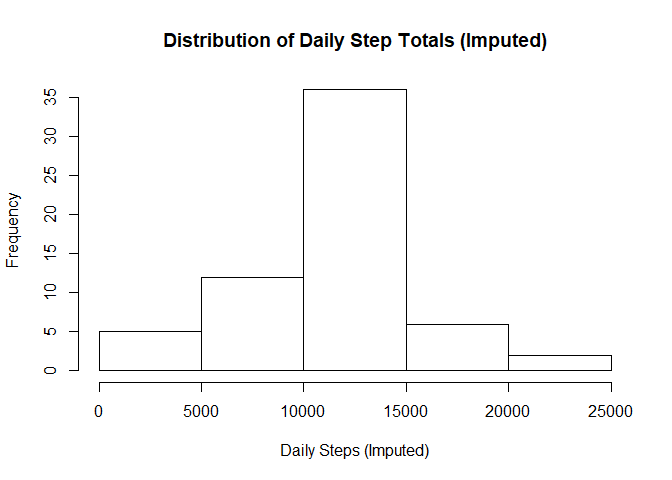
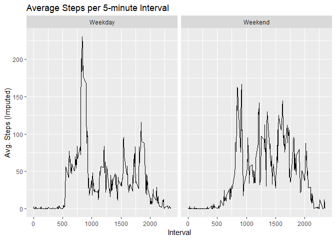

### Loading and preprocessing the data

#### 1. Load the data

```r
activity <- read.csv("C:/Users/smart/Documents/R/data/activity.csv")
```

#### 2. Process/transform the data (if necessary) into a format suitable for your analysis

Not necessary.


### What is mean total number of steps taken per day?

For this part of the assignment, you can ignore the missing values in
the dataset.  
  

#### 1. Make a histogram of the total number of steps taken each day
  
- Calculate daily step totals ignoring missing values

```r
dailysteps <- aggregate(activity$steps, list(activity$date), FUN=sum)
names(dailysteps) <- c("Date","Daily Steps")
```

- Generate histogram

```r
hist(dailysteps$`Daily Steps`, main = "Distribution of Daily Step Totals", xlab = "Daily Steps")
```

<!-- -->
  
  
#### 2. Calculate and report the **mean** and **median** total number of steps taken per day

The `summary` command generates high-level statistics, which include the mean and median. 

```r
summary(dailysteps$`Daily Steps`)
```

```
##    Min. 1st Qu.  Median    Mean 3rd Qu.    Max.    NA's 
##      41    8841   10765   10766   13294   21194       8
```


### What is the average daily activity pattern?
  
  
#### 1. Make a time series plot (i.e. `type = "l"`) of the 5-minute interval (x-axis) and the average number of steps taken, averaged across all days (y-axis)

- Calculate mean steps for each 5-min. interval across all days ignoring missing values

```r
fiveminsteps <- aggregate(activity$steps, list(activity$interval), FUN=mean, na.action=na.pass, na.rm=TRUE)
names(fiveminsteps) <- c("Interval","Avg. Steps")
```

- Generate plot

```r
plot(fiveminsteps, type="l", main = "Average Steps per 5-minute Interval")
```

<!-- -->
  

#### 2. Which 5-minute interval, on average across all the days in the dataset, contains the maximum number of steps?

We can see that on average, the interval starting at 8:35 am has the most number of steps at over 206.

```r
fiveminsteps[which(fiveminsteps$`Avg. Steps`==max(fiveminsteps$`Avg. Steps`)),]
```

```
##     Interval Avg. Steps
## 104      835   206.1698
```


### Imputing missing values

Note that there are a number of days/intervals where there are missing
values (coded as `NA`). The presence of missing days may introduce
bias into some calculations or summaries of the data.
  

#### 1. Calculate and report the total number of missing values in the dataset (i.e. the total number of rows with `NA`s)

```r
sum(is.na(activity$steps))
```

```
## [1] 2304
```
  

#### 2. Devise a strategy for filling in all of the missing values in the dataset. The strategy does not need to be sophisticated. For example, you could use the mean/median for that day, or the mean for that 5-minute interval, etc.

We can use the mean number of steps for a given interval across all days to fill in the missing values.
  

#### 3. Create a new dataset that is equal to the original dataset but with the missing data filled in.

- Creating copy of activity dataset

```r
activity2 <- activity
```

- Imputing missing values in 'steps' using interval means

```r
activity2$steps[is.na(activity2$steps)] <-
        ave(activity2$steps,activity2$interval, FUN=function(x)mean(x,na.rm = T))[is.na(activity2$steps)]
```
  

#### 4. Make a histogram of the total number of steps taken each day and Calculate and report the **mean** and **median** total number of steps taken per day. Do these values differ from the estimates from the first part of the assignment? What is the impact of imputing missing data on the estimates of the total daily number of steps?

- Calculate new daily step totals

```r
dailysteps2 <- aggregate(activity2$steps, list(activity2$date), FUN=sum)
names(dailysteps2) <- c("Date","Daily Steps (Imputed)")
```

- Histogram of new daily step totals

```r
hist(dailysteps2$`Daily Steps`, main = "Distribution of Daily Step Totals (Imputed)", xlab = "Daily Steps (Imputed)")
```

<!-- -->

Given that previously missing values were simply ignored, effectively counting as zeroes in the daily totals, we can see that imputing mean interval step counts has increased the middle of the distribution by approximately 10 more daily totals falling into that step range (10,000 - 15,000 steps).

- Calculate mean and median of new daily step totals

```r
summary(dailysteps2$`Daily Steps (Imputed)`)
```

```
##    Min. 1st Qu.  Median    Mean 3rd Qu.    Max. 
##      41    9819   10766   10766   12811   21194
```

Imputing mean interval step counts has not affected the mean and median.
  

### Are there differences in activity patterns between weekdays and weekends?

For this part the `weekdays()` function may be of some help here. Use
the dataset with the filled-in missing values for this part.
  

#### 1. Create a new factor variable in the dataset with two levels -- "weekday" and "weekend" indicating whether a given date is a weekday or weekend day.


```r
for (i in 1:nrow(activity2)) {
        activity2$Day[i] <- ifelse(weekdays(as.Date(activity2$date[i])) %in% c("Saturday","Sunday"),
                                   "Weekend","Weekday")
}
activity2$Day <- as.factor(activity2$Day)
```
  

#### 2. Make a panel plot containing a time series plot (i.e. `type = "l"`) of the 5-minute interval (x-axis) and the average number of steps taken, averaged across all weekday days or weekend days (y-axis).

- Calculate new mean steps for each 5-min. interval by day type for all days


```r
fiveminsteps2 <- aggregate(activity2$steps, list(activity2$interval, activity2$Day),FUN=mean)
names(fiveminsteps2) <- c("Interval","Day","Avg. Steps (Imputed)")
```

- Generate multipanel plot


```r
library(ggplot2)

g <- ggplot(fiveminsteps2, aes(Interval,`Avg. Steps (Imputed)`))
g + geom_line() + facet_grid(. ~ Day) + labs(title = "Average Steps per 5-minute Interval",
         x = "Interval", y = "Avg. Steps (Imputed)")
```

<!-- -->

There are some marked differences in activity patterns between weekdays and weekends.

1. Activity during weekdays commences shortly after 5 am whereas on weekends the first marked activity spike happens only around 8 am.

2. The highest activity period during weekdays is between approximately 8 and 9:30 am, while on weekends activity is more sustained during day hours.

3. Activity levels die down from around 7:30 pm during the week, but not until well past 8 pm during weekends. 
